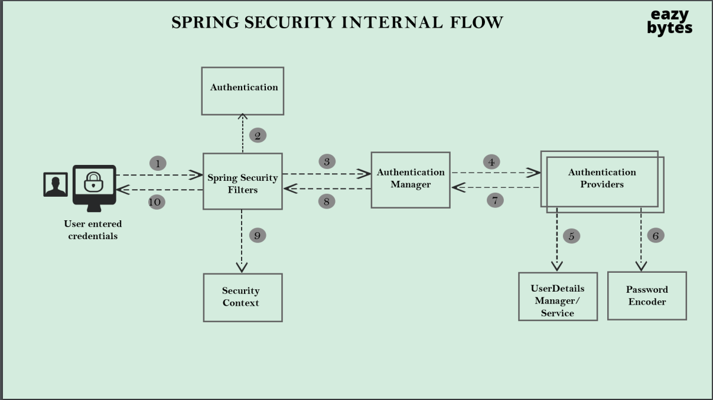
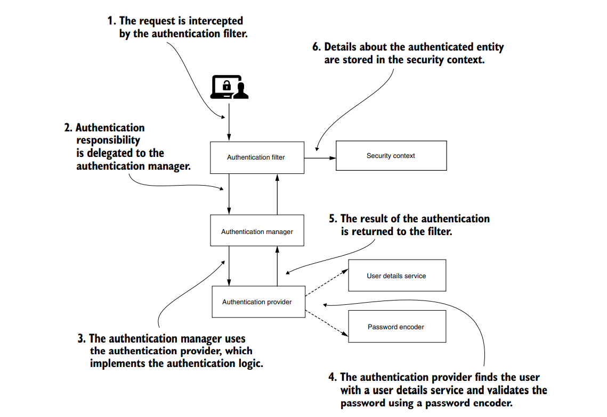
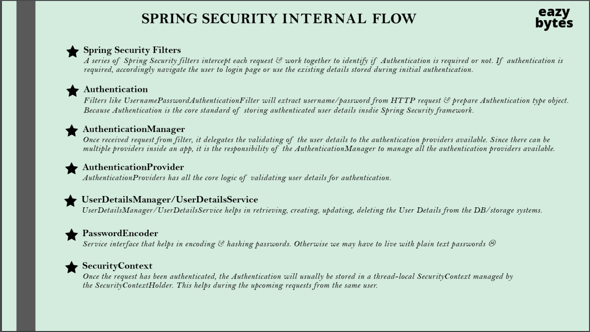
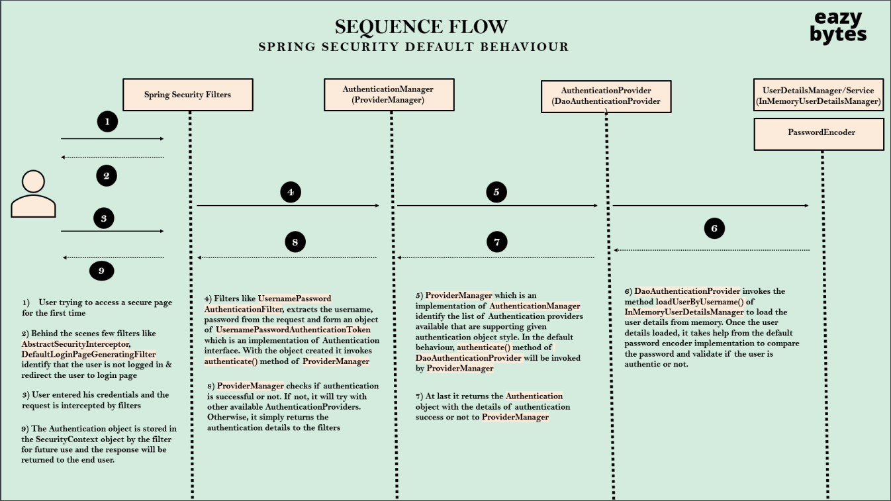
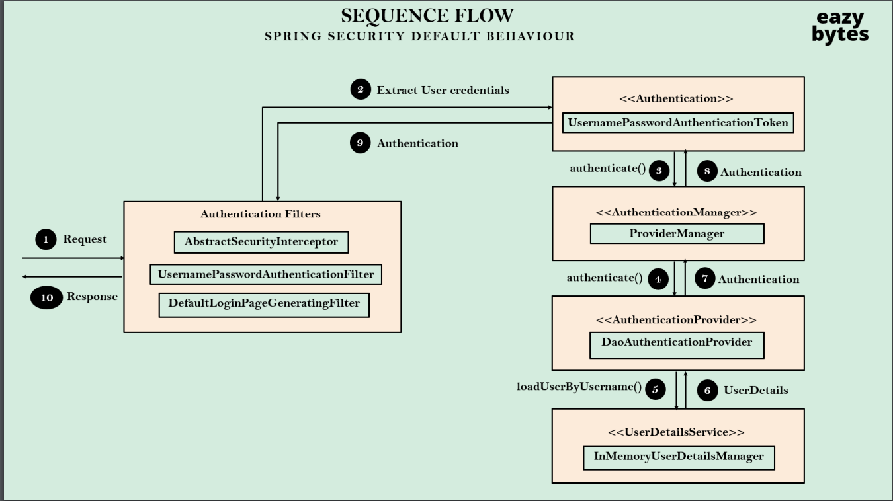
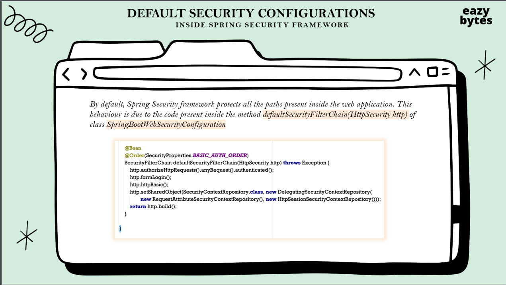

## Section 2
- Authentication is the process of knowing and identifying the user that wants to access.
- Once Spring Security authenticates a user, it will store the authentication object with the authentication principal in the session.
- Authorization is the process to allow the authority to perform actions and access the resources in the Spring application.
- Spring Security provides HTTP basic authentication to authenticate the user at the client-side and send the user credentials with the request header to the server.
- The server receives these credentials, extract them from the header, and map them with the existing record to validate the user.
- The httpBasic() method is used to enable the feature to authenticate the user during HTTP request.

The AuthenticationManager receives a request from the HTTP filter layer and delegates the responsibility to authenticate the user to the AuthenticationProvider.

- If the user making the request is not authenticated, the response status sent back to the client is HTTP 401 Unauthorized.
- If the user is authenticated, user details along with authentication status are stored in the SecurityContext.

