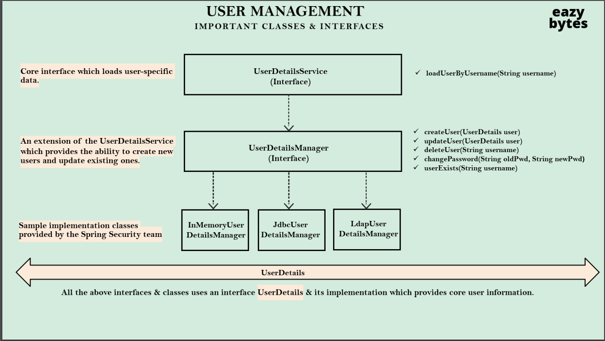
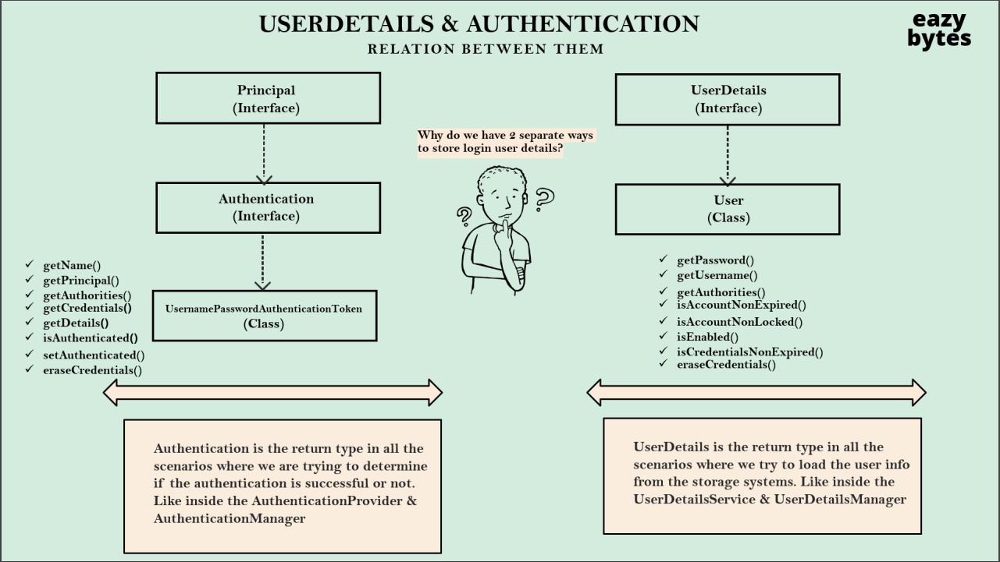
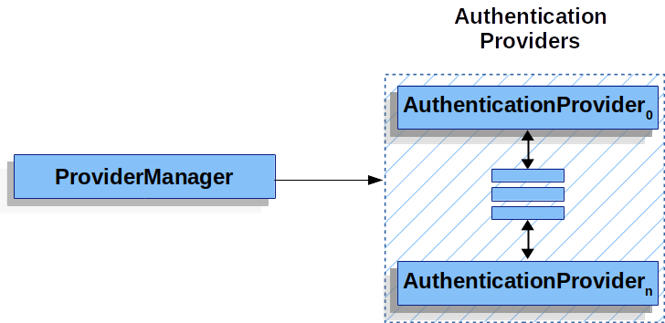
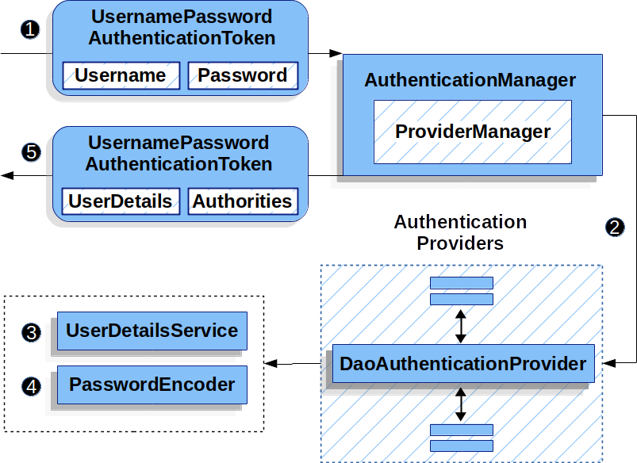
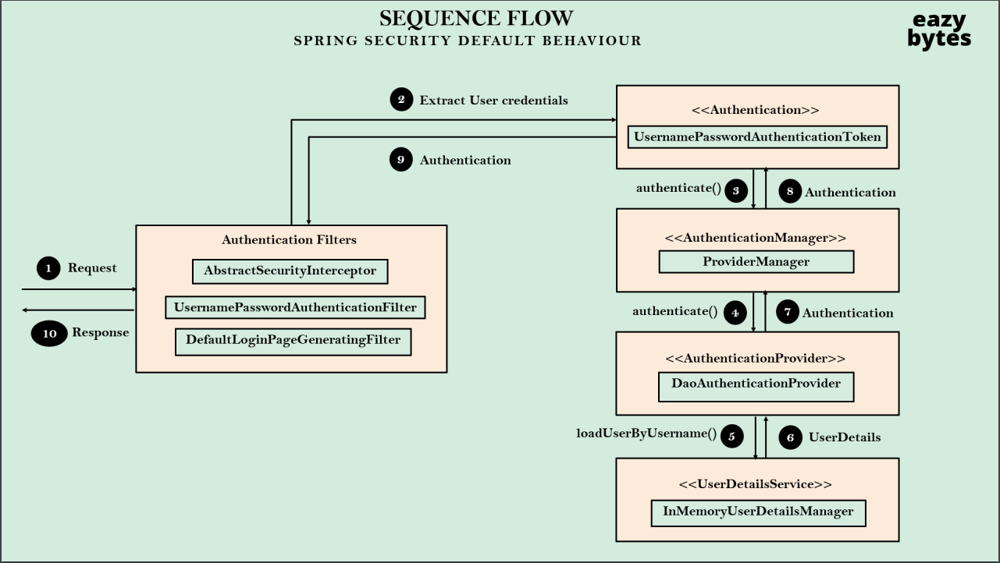
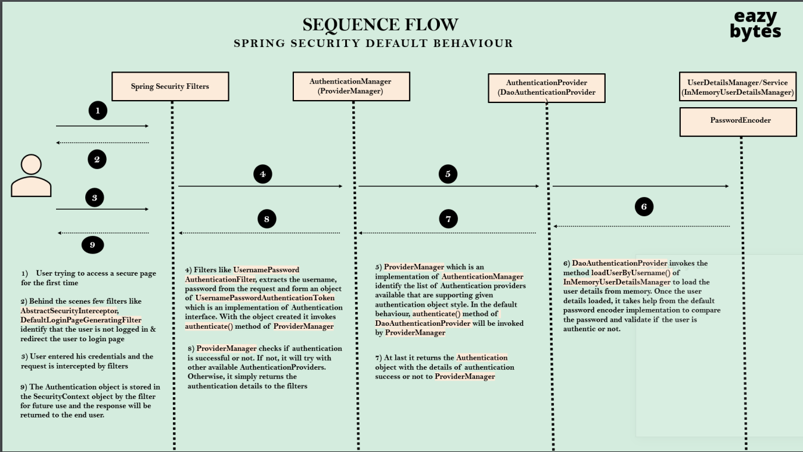
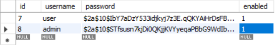
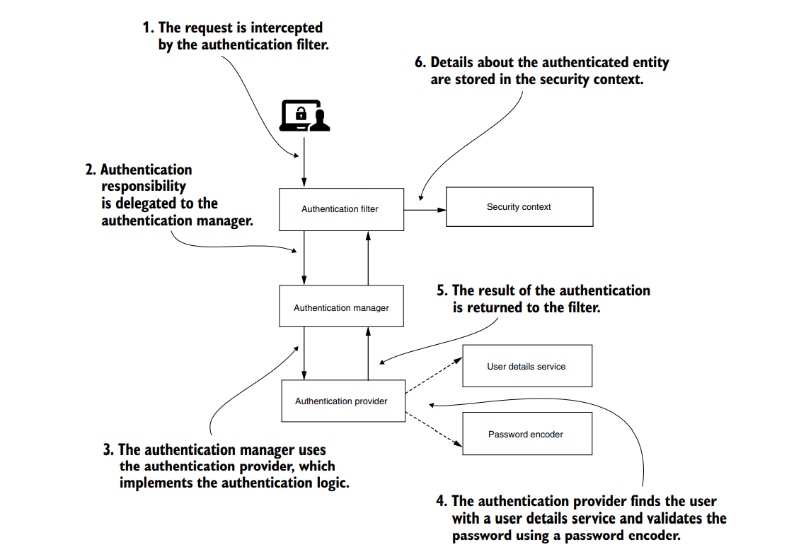

# Section 3: Defining and Managing Users

After applying the security configuration, we can define users for this application.


There are many ways to do that:

1 - Define a single static user inside the application.properties

```properties
spring.security.user.name=khaled
spring.security.user.password=123
```

Now, you can use this credential to login through the basic login form.

------------------------------------------------------------------------

2 - Define multiple static users within memory by <b><i>InMemoryUserDetailsManager</i></b>

```java
import org.springframework.context.annotation.Bean;
import org.springframework.context.annotation.Configuration;
import org.springframework.security.config.annotation.web.builders.HttpSecurity;
import org.springframework.security.core.userdetails.User;
import org.springframework.security.core.userdetails.UserDetails;
import org.springframework.security.crypto.bcrypt.BCryptPasswordEncoder;
import org.springframework.security.crypto.password.PasswordEncoder;
import org.springframework.security.provisioning.InMemoryUserDetailsManager;
import org.springframework.security.web.SecurityFilterChain;

@Configuration
public class SecurityConfig {

    @Bean
    SecurityFilterChain securityFilterChain(HttpSecurity http) throws Exception {
        http.authorizeHttpRequests().anyRequest().authenticated()
                .and().formLogin()
                .and().httpBasic();
        return http.build();
    }
    
    /*
     * The formLogin() method call enables form-based authentication,
     *  which allows users to authenticate by submitting a form containing their username and password.
     * 
     * The httpBasic() method call enables HTTP Basic authentication,
     *  which allows users to authenticate using their username and password in the HTTP request headers.
     * */


    @Bean
    InMemoryUserDetailsManager memoryUserDetailsManager(){
        UserDetails admin = User.builder()
                .username("khaled")
                .password(passwordEncoder().encode("123"))
                .authorities("admin")
                .build();

        UserDetails user = User.builder()
                .username("user")
                .password(passwordEncoder().encode("123"))
                .authorities("user")
                .build();

        return new InMemoryUserDetailsManager(admin, user);
    }

    @Bean
    public PasswordEncoder passwordEncoder(){
        return new BCryptPasswordEncoder();
    }


}

```

To make our application work, we need to:

- encode the password before storing it.
- tell the spring security what encoder we used in the authentication process

Let's take a look at tow of the encoders provided by spring security:

- BCryptPasswordEncoder: Uses a bcrypt strong hashing function to encode a password (Best solution)
- NoOpPasswordEncoder: Doesn't do anything. It only compares the strings using equals() method.

```java
    ...
public PasswordEncoder passwordEncoder(){
        return NoOpPasswordEncoder.getInstance();
    }
    ...
```

### Note:
The previous approaches are useful for testing (not production).
So, We usually store users in a database.

-----------------------------------------------------------------------

## Understanding user management interfaces and classes



#### Authentication Scenario

1 - Enter the username and password inside the browser. <b>(By login form)</b>

2 - load the user details so that you can compare with the user details that you have inside the storage system and what the end user entered inside the browser (Authentication Process). <b>(By loadUserByUsername(String username) abstract method in UserDetailsService interface)</b>


Note: 

1 - InMemoryUserDetailsManager class implements UserDetailsManager and UserDetailsPasswordService.

```java
public interface UserDetailsManager extends UserDetailsService {
    void createUser(UserDetails user);

    void updateUser(UserDetails user);

    void deleteUser(String username);

    void changePassword(String oldPassword, String newPassword);

    boolean userExists(String username);
}

public interface UserDetailsService {
    UserDetails loadUserByUsername(String username) throws UsernameNotFoundException;
}
```

So, InMemoryUserDetailsManager implements loadUserByUsername: 


```java
    public UserDetails loadUserByUsername(String username) throws UsernameNotFoundException {
        UserDetails user = (UserDetails)this.users.get(username.toLowerCase());
        if (user == null) {
            throw new UsernameNotFoundException(username);
        } else {
            return new User(user.getUsername(), user.getPassword(), user.isEnabled(), user.isAccountNonExpired(), user.isCredentialsNonExpired(), user.isAccountNonLocked(), user.getAuthorities());
        }
    }
```


2 - As you see, the UserDetailsManager interface contains some useful methods to create new users in the system storage and manage them.

3 - There are some approaches to store users details (implementation classes for UserDetailsManager interface)

- InMemoryUserDetailsManager
- JdbcUserDetailsManager
- LdapUserDetailsManager


Q/ why we are loading user details from the storage system only with the username?
Why not both username, password and authorities?

Because they will be checked automatically by Spring Security.



-----------------------------------------------------------------------------------------------

## SecurityContextHolder


The SecurityContextHolder is where Spring Security stores the details of who is authenticated.

## SecurityContext
The SecurityContext is obtained from the SecurityContextHolder.
The SecurityContext contains an Authentication object.

## Authentication

The Authentication interface serves two main purposes within Spring Security:

- An input to AuthenticationManager to provide the credentials a user has provided to authenticate. When used in this scenario, isAuthenticated() returns false.

- Represent the currently authenticated user. You can obtain the current Authentication from the SecurityContext.

### The Authentication contains:

- principal: Identifies the user. When authenticating with a username/password this is often an instance of UserDetails.

- credentials: Often a password. In many cases, this is cleared after the user is authenticated, to ensure that it is not leaked.

- authorities: The GrantedAuthority instances are high-level permissions the user is granted. Two examples are roles and scopes.

## GrantedAuthority

GrantedAuthority instances are high-level permissions that the user is granted

It is an authority that is granted to the principal. Such authorities are usually “roles”,
such as ROLE_ADMINISTRATOR or ROLE_HR_SUPERVISOR.

When using username/password based authentication GrantedAuthority instances are usually loaded by the UserDetailsService.

## AuthenticationManager

AuthenticationManager is the API that defines how Spring Security’s Filters perform authentication.

While the implementation of AuthenticationManager could be anything, the most common implementation is ProviderManager.


## ProviderManager

- ProviderManager is the most commonly used implementation of AuthenticationManager.
- ProviderManager delegates to a List of AuthenticationProvider instances.
- Each AuthenticationProvider has an opportunity to indicate that authentication should be successful, fail, or indicate it cannot make a decision and allow a downstream AuthenticationProvider to decide.



In practice each AuthenticationProvider knows how to perform a specific type of authentication.
For example, one AuthenticationProvider might be able to validate a username/password,
while another might be able to authenticate a SAML assertion.

By default, ProviderManager tries to clear any sensitive credentials information from the Authentication object that is returned by a successful authentication request. This prevents information, such as passwords, being retained longer than necessary in the HttpSession.

## AuthenticationProvider

- You can inject multiple AuthenticationProviders instances into ProviderManager.
- Each AuthenticationProvider performs a specific type of authentication.
- For example, DaoAuthenticationProvider supports username/password-based authentication,
while JwtAuthenticationProvider supports authenticating a JWT token.

## AbstractAuthenticationProcessingFilter

AbstractAuthenticationProcessingFilter is used as a base Filter for authenticating a user’s credentials.

Before the credentials can be authenticated, Spring Security typically requests the credentials by using AuthenticationEntryPoint.

Next, the AbstractAuthenticationProcessingFilter can authenticate any authentication requests that are submitted to it.


1- When the user submits their credentials, the AbstractAuthenticationProcessingFilter creates an Authentication from the HttpServletRequest to be authenticated.

- The type of Authentication created depends on the subclass of AbstractAuthenticationProcessingFilter.

- For example, UsernamePasswordAuthenticationFilter creates a UsernamePasswordAuthenticationToken from a username and password that are submitted in the HttpServletRequest.


2 - Next, the Authentication is passed into the AuthenticationManager to be authenticated.

3 - If authentication fails, then Failure.

- The SecurityContextHolder is cleared out.

- RememberMeServices.loginFail is invoked. If remember me is not configured, this is a no-op. See to remember me package.

- AuthenticationFailureHandler is invoked. See the AuthenticationFailureHandler interface.


4 - If authentication is successful, then Success.

- SessionAuthenticationStrategy is notified of a new login. See the SessionAuthenticationStrategy interface.

- The Authentication is set on the SecurityContextHolder. Later, the SecurityContextPersistenceFilter saves the SecurityContext to the HttpSession. See the SecurityContextPersistenceFilter class.

- RememberMeServices.loginSuccess is invoked. If remember me is not configured, this is a no-op. See the rememberme package.

- ApplicationEventPublisher publishes an InteractiveAuthenticationSuccessEvent.

- AuthenticationSuccessHandler is invoked. See the AuthenticationSuccessHandler interface.

--------------------------------------------------------------------------------------------------------------------

## DaoAuthenticationProvider

DaoAuthenticationProvider is an AuthenticationProvider implementation that uses a UserDetailsService and PasswordEncoder to authenticate a username and password.



- The authentication Filter from the Reading the Username & Password section passes a UsernamePasswordAuthenticationToken to the AuthenticationManager, which is implemented by ProviderManager.

- The ProviderManager is configured to use an AuthenticationProvider of type DaoAuthenticationProvider.

- DaoAuthenticationProvider looks up the UserDetails from the UserDetailsService.

- DaoAuthenticationProvider uses the PasswordEncoder to validate the password on the UserDetails returned in the previous step.

- When authentication is successful, the Authentication that is returned is of type UsernamePasswordAuthenticationToken and has a principal that is the UserDetails returned by the configured UserDetailsService. Ultimately, the returned UsernamePasswordAuthenticationToken is set on the SecurityContextHolder by the authentication Filter.






--------------------------------------------------------------------------------------------------------------------

## Connection and creating user in DB

### Default Schema:

Spring Security provides default queries for JDBC-based authentication.

JdbcDaoImpl requires tables to load the password, account status (enabled or disabled) and a list of authorities (roles) for the user.

The default schema is also exposed as a classpath resource named org/springframework/security/core/userdetails/jdbc/users.ddl.

#### User Schema

```roomsql
create table users(
    `id` INT NOT NULL AUTO_INCREMENT,
	username varchar(50) not null,
	password varchar(500) not null,
	enabled boolean not null,
	PRIMARY KEY (`id`));

create table authorities (
   `id` INT NOT NULL AUTO_INCREMENT,
	username varchar(50) not null,
	authority varchar(50) not null,
    PRIMARY KEY (`id`),
	constraint fk_authorities_users foreign key(id) references users(id)
	);
```

#### Group Schema

If your application uses groups, you need to provide the groups schema:

```roomsql
create table groups (
	id bigint generated by default as identity(start with 0) primary key,
	group_name varchar_ignorecase(50) not null
);

create table group_authorities (
	group_id bigint not null,
	authority varchar(50) not null,
	constraint fk_group_authorities_group foreign key(group_id) references groups(id)
);

create table group_members (
	id bigint generated by default as identity(start with 0) primary key,
	username varchar(50) not null,
	group_id bigint not null,
	constraint fk_group_members_group foreign key(group_id) references groups(id)
);
```

#### JdbcUserDetailsManager Bean

```java
@Bean
UserDetailsManager users(DataSource dataSource) {
	UserDetails user = User.builder()
		.username("user")
		.password("{bcrypt}$2a$10$GRLdNijSQMUvl/au9ofL.eDwmoohzzS7.rmNSJZ.0FxO/BTk76klW")
		.roles("USER")
		.build();
	UserDetails admin = User.builder()
		.username("admin")
		.password("{bcrypt}$2a$10$GRLdNijSQMUvl/au9ofL.eDwmoohzzS7.rmNSJZ.0FxO/BTk76klW")
		.roles("USER", "ADMIN")
		.build();
	JdbcUserDetailsManager users = new JdbcUserDetailsManager(dataSource);
	users.createUser(user);
	users.createUser(admin);
	return users;
}

@Bean
public PasswordEncoder passwordEncoder() {
        return new BCryptPasswordEncoder();
        }

```



Now, you can login with these users

------------------------------------------------------------------------------------

If your DB contains user details, you will use the following method instead of the previous method.

```java
@Bean
    UserDetailsService userDetailsService(DataSource dataSource){
        return new JdbcUserDetailsManager(dataSource);
    }
```

Spring Boot will automatically create an object of data source inside my web application.

So, that's why when I try to pass this data source object to this JdbcUserDetailsManager,
so I'm telling to my JdbcUserDetailsManager there is a database that I have created and the details 
of the database is present inside this data source.

------------------------------------------------------------------------------------

### Custom Schema

You can create your custom DB Schema, but in this case you must change the default implementation 
of the loadUserByUsername abstract method in the UserDetailsService interface with your custom logic
that deals with the fields of your new schema.

You must do that in order for AuthenticationProvider to deal with your DB

[Example](../Section3/JDBCAuthentication)
------------------------------------------------------------------------------------

## Spring Security Authentication Process Explained In Detailed [Core classes and interfaces]

## Authentication

- It is a core interface that represents security information(Principal, Credentials, Authority list, etc.)
  in a spring security specific manner used by the framework whenever there is a need to get authentication details of a particular request.

- Frequently used implementation of the “Authentication” interface is <b>“UsernamePasswordAuthenticationToken”</b>.
  It is not a direct subclass of “Authentication” but it is a child of an abstract class that implements an “Authentication” interface.


### The Authentication contains:

- principal: Identifies the user. When authenticating with a username/password this is often an instance of UserDetails.

- credentials: Often a password. In many cases, this is cleared after the user is authenticated, to ensure that it is not leaked.

- authorities: The GrantedAuthority instances are high-level permissions the user is granted. Two examples are roles and scopes.

```java
public interface Authentication extends Principal, Serializable {
    Collection<? extends GrantedAuthority> getAuthorities();

    Object getCredentials();

    Object getDetails();

    Object getPrincipal();

    boolean isAuthenticated();

    void setAuthenticated(boolean isAuthenticated) throws IllegalArgumentException;
}
```

```java
public abstract class AbstractAuthenticationToken implements Authentication, CredentialsContainer {
    private final Collection<GrantedAuthority> authorities;
    private Object details;
    private boolean authenticated = false;

    public AbstractAuthenticationToken(Collection<? extends GrantedAuthority> authorities) {
        if (authorities == null) {
            this.authorities = AuthorityUtils.NO_AUTHORITIES;
        } else {
            Iterator var2 = authorities.iterator();

            while(var2.hasNext()) {
                GrantedAuthority a = (GrantedAuthority)var2.next();
                Assert.notNull(a, "Authorities collection cannot contain any null elements");
            }

            this.authorities = Collections.unmodifiableList(new ArrayList(authorities));
        }
    }

    public Collection<GrantedAuthority> getAuthorities() {
        return this.authorities;
    }

    public String getName() {
        if (this.getPrincipal() instanceof UserDetails) {
            return ((UserDetails)this.getPrincipal()).getUsername();
        } else if (this.getPrincipal() instanceof AuthenticatedPrincipal) {
            return ((AuthenticatedPrincipal)this.getPrincipal()).getName();
        } else if (this.getPrincipal() instanceof Principal) {
            return ((Principal)this.getPrincipal()).getName();
        } else {
            return this.getPrincipal() == null ? "" : this.getPrincipal().toString();
        }
    }

    public boolean isAuthenticated() {
        return this.authenticated;
    }

    public void setAuthenticated(boolean authenticated) {
        this.authenticated = authenticated;
    }

    public Object getDetails() {
        return this.details;
    }

    public void setDetails(Object details) {
        this.details = details;
    }

    public void eraseCredentials() {
        this.eraseSecret(this.getCredentials());
        this.eraseSecret(this.getPrincipal());
        this.eraseSecret(this.details);
    }

    private void eraseSecret(Object secret) {
        if (secret instanceof CredentialsContainer) {
            ((CredentialsContainer)secret).eraseCredentials();
        }

    }

    public boolean equals(Object obj) {
        if (!(obj instanceof AbstractAuthenticationToken test)) {
            return false;
        } else if (!this.authorities.equals(test.authorities)) {
            return false;
        } else if (this.details == null && test.getDetails() != null) {
            return false;
        } else if (this.details != null && test.getDetails() == null) {
            return false;
        } else if (this.details != null && !this.details.equals(test.getDetails())) {
            return false;
        } else if (this.getCredentials() == null && test.getCredentials() != null) {
            return false;
        } else if (this.getCredentials() != null && !this.getCredentials().equals(test.getCredentials())) {
            return false;
        } else if (this.getPrincipal() == null && test.getPrincipal() != null) {
            return false;
        } else if (this.getPrincipal() != null && !this.getPrincipal().equals(test.getPrincipal())) {
            return false;
        } else {
            return this.isAuthenticated() == test.isAuthenticated();
        }
    }

    public int hashCode() {
        int code = 31;

        GrantedAuthority authority;
        for(Iterator var2 = this.authorities.iterator(); var2.hasNext(); code ^= authority.hashCode()) {
            authority = (GrantedAuthority)var2.next();
        }

        if (this.getPrincipal() != null) {
            code ^= this.getPrincipal().hashCode();
        }

        if (this.getCredentials() != null) {
            code ^= this.getCredentials().hashCode();
        }

        if (this.getDetails() != null) {
            code ^= this.getDetails().hashCode();
        }

        if (this.isAuthenticated()) {
            code ^= -37;
        }

        return code;
    }

    public String toString() {
        StringBuilder sb = new StringBuilder();
        sb.append(this.getClass().getSimpleName()).append(" [");
        sb.append("Principal=").append(this.getPrincipal()).append(", ");
        sb.append("Credentials=[PROTECTED], ");
        sb.append("Authenticated=").append(this.isAuthenticated()).append(", ");
        sb.append("Details=").append(this.getDetails()).append(", ");
        sb.append("Granted Authorities=").append(this.authorities);
        sb.append("]");
        return sb.toString();
    }
}

```

```java
public class UsernamePasswordAuthenticationToken extends AbstractAuthenticationToken {
    private static final long serialVersionUID = 600L;
    private final Object principal;
    private Object credentials;

    public UsernamePasswordAuthenticationToken(Object principal, Object credentials) {
        super((Collection)null);
        this.principal = principal;
        this.credentials = credentials;
        this.setAuthenticated(false);
    }

    public UsernamePasswordAuthenticationToken(Object principal, Object credentials, Collection<? extends GrantedAuthority> authorities) {
        super(authorities);
        this.principal = principal;
        this.credentials = credentials;
        super.setAuthenticated(true);
    }

    public static UsernamePasswordAuthenticationToken unauthenticated(Object principal, Object credentials) {
        return new UsernamePasswordAuthenticationToken(principal, credentials);
    }

    public static UsernamePasswordAuthenticationToken authenticated(Object principal, Object credentials, Collection<? extends GrantedAuthority> authorities) {
        return new UsernamePasswordAuthenticationToken(principal, credentials, authorities);
    }

    public Object getCredentials() {
        return this.credentials;
    }

    public Object getPrincipal() {
        return this.principal;
    }

    public void setAuthenticated(boolean isAuthenticated) throws IllegalArgumentException {
        Assert.isTrue(!isAuthenticated, "Cannot set this token to trusted - use constructor which takes a GrantedAuthority list instead");
        super.setAuthenticated(false);
    }

    public void eraseCredentials() {
        super.eraseCredentials();
        this.credentials = null;
    }
}
```

----------------------------------------------------------------------------------------------------------------

## AuthenticationManager

- It is a core interface that spring security uses for the authentication process.
- It has only one method authenticate which when implemented in a class that implements an Authentication Manager has all the logic for authenticating a user request. 
- The authenticate method takes an “Authentication” object as its parameter and returns an “Authentication” object on successful authentication of the user or else we can have an exception thrown indicating that the user is not authenticated. 
- Spring security has a default implementation for Authentication Manager that is <b>“ProviderManager”</b> which itself delegates the authentication request to list of configured “AuthenticationProvider”s which can either return a fully populated “Authentication” object, throw an exception when authentication is failed or return null if it needs to skip the authentication for a particular authentication request.

```java
public interface AuthenticationManager {
    Authentication authenticate(Authentication authentication) throws AuthenticationException;
}
```

```java
public class ProviderManager implements AuthenticationManager, MessageSourceAware, InitializingBean {
    private static final Log logger = LogFactory.getLog(ProviderManager.class);
    private AuthenticationEventPublisher eventPublisher;
    private List<AuthenticationProvider> providers;
    protected MessageSourceAccessor messages;
    private AuthenticationManager parent;
    private boolean eraseCredentialsAfterAuthentication;

    public ProviderManager(AuthenticationProvider... providers) {
        this(Arrays.asList(providers), (AuthenticationManager)null);
    }

    public ProviderManager(List<AuthenticationProvider> providers) {
        this(providers, (AuthenticationManager)null);
    }

    public ProviderManager(List<AuthenticationProvider> providers, AuthenticationManager parent) {
        this.eventPublisher = new NullEventPublisher();
        this.providers = Collections.emptyList();
        this.messages = SpringSecurityMessageSource.getAccessor();
        this.eraseCredentialsAfterAuthentication = true;
        Assert.notNull(providers, "providers list cannot be null");
        this.providers = providers;
        this.parent = parent;
        this.checkState();
    }

    public void afterPropertiesSet() {
        this.checkState();
    }

    private void checkState() {
        Assert.isTrue(this.parent != null || !this.providers.isEmpty(), "A parent AuthenticationManager or a list of AuthenticationProviders is required");
        Assert.isTrue(!CollectionUtils.contains(this.providers.iterator(), (Object)null), "providers list cannot contain null values");
    }

    public Authentication authenticate(Authentication authentication) throws AuthenticationException {
        Class<? extends Authentication> toTest = authentication.getClass();
        AuthenticationException lastException = null;
        AuthenticationException parentException = null;
        Authentication result = null;
        Authentication parentResult = null;
        int currentPosition = 0;
        int size = this.providers.size();
        Iterator var9 = this.getProviders().iterator();

        while(var9.hasNext()) {
            AuthenticationProvider provider = (AuthenticationProvider)var9.next();
            if (provider.supports(toTest)) {
                if (logger.isTraceEnabled()) {
                    Log var10000 = logger;
                    String var10002 = provider.getClass().getSimpleName();
                    ++currentPosition;
                    var10000.trace(LogMessage.format("Authenticating request with %s (%d/%d)", var10002, currentPosition, size));
                }

                try {
                    result = provider.authenticate(authentication);
                    if (result != null) {
                        this.copyDetails(authentication, result);
                        break;
                    }
                } catch (InternalAuthenticationServiceException | AccountStatusException var14) {
                    this.prepareException(var14, authentication);
                    throw var14;
                } catch (AuthenticationException var15) {
                    lastException = var15;
                }
            }
        }

        if (result == null && this.parent != null) {
            try {
                parentResult = this.parent.authenticate(authentication);
                result = parentResult;
            } catch (ProviderNotFoundException var12) {
            } catch (AuthenticationException var13) {
                parentException = var13;
                lastException = var13;
            }
        }

        if (result != null) {
            if (this.eraseCredentialsAfterAuthentication && result instanceof CredentialsContainer) {
                ((CredentialsContainer)result).eraseCredentials();
            }

            if (parentResult == null) {
                this.eventPublisher.publishAuthenticationSuccess(result);
            }

            return result;
        } else {
            if (lastException == null) {
                lastException = new ProviderNotFoundException(this.messages.getMessage("ProviderManager.providerNotFound", new Object[]{toTest.getName()}, "No AuthenticationProvider found for {0}"));
            }

            if (parentException == null) {
                this.prepareException((AuthenticationException)lastException, authentication);
            }

            throw lastException;
        }
    }

    private void prepareException(AuthenticationException ex, Authentication auth) {
        this.eventPublisher.publishAuthenticationFailure(ex, auth);
    }

    private void copyDetails(Authentication source, Authentication dest) {
        if (dest instanceof AbstractAuthenticationToken token && dest.getDetails() == null) {
            token.setDetails(source.getDetails());
        }

    }

    public List<AuthenticationProvider> getProviders() {
        return this.providers;
    }

    public void setMessageSource(MessageSource messageSource) {
        this.messages = new MessageSourceAccessor(messageSource);
    }

    public void setAuthenticationEventPublisher(AuthenticationEventPublisher eventPublisher) {
        Assert.notNull(eventPublisher, "AuthenticationEventPublisher cannot be null");
        this.eventPublisher = eventPublisher;
    }

    public void setEraseCredentialsAfterAuthentication(boolean eraseSecretData) {
        this.eraseCredentialsAfterAuthentication = eraseSecretData;
    }

    public boolean isEraseCredentialsAfterAuthentication() {
        return this.eraseCredentialsAfterAuthentication;
    }

    private static final class NullEventPublisher implements AuthenticationEventPublisher {
        private NullEventPublisher() {
        }

        public void publishAuthenticationFailure(AuthenticationException exception, Authentication authentication) {
        }

        public void publishAuthenticationSuccess(Authentication authentication) {
        }
    }
}

```
We can create out custom implementation:

```java
public class CustomAuthenticationManager implements AuthenticationManager {

    @Autowired
    UserRepo userRepo;

    @Autowired
    PasswordEncoder passwordEncoder;

    @Override
    public Authentication authenticate(Authentication authentication) throws AuthenticationException {
        Optional<User> user = userRepo.findByUserName(authentication.getName());
        if (user.isPresent()) {
            if (passwordEncoder.matches(authentication.getCredentials().toString(), user.get().getPassword())) {
                List<GrantedAuthority> grantedAuthorityList = new ArrayList<>();
                for (Role role : user.get().getRoleSet()) {
                    grantedAuthorityList.add(new SimpleGrantedAuthority(role.getName()));
                }
                return new UsernamePasswordAuthenticationToken(authentication.getPrincipal(), authentication.getCredentials(), grantedAuthorityList);
            } else {
                throw new BadCredentialsException("Wrong Password");
            }
        } else {
            throw new BadCredentialsException("Wrong UserName");
        }
    }
}
```

------------------------------------------------------------------------------------------------

## UserDetailsService

- It is a core interface that is used by spring security to return the “UserDetails” object.
- It is purely used to return user data wrapped in the form of “UserDetails”.
- It has one method loadUserByUsername(String userName). As you can see it takes one String-based argument username and it returns a “UserDetails” object.
- The only purpose of “UserDetailsService” is to provide a “UserDetails” object to other components of the spring security framework.

```java
public interface UserDetailsService {
    UserDetails loadUserByUsername(String username) throws UsernameNotFoundException;
}
```

------------------------------------------------------------------------------------------------

## UserDetails
- It acts as an adapter between your application’s user representation and the representation of the user’s details that are needed by the spring security framework in the “SecurityContextHolder” which is basically used to build the “Authentication” object and have other functionality too which is described in next section.

- “UserDetails” basically holds principals, credentials, authorities and other information that is regarding a particular user.

## GrantedAuthority
- It is an interface that represents authorities that are granted to the user. A class implementing this interface should provide the representation of the user authority that is supported by “AccessDecisionManager” that we will cover in the next article that is on Authorization in spring security.

- It is provided in the “UserDetails” object and used to give application-wide permissions. It should not be used to give per object permission for that spring security provided other interface.

- It is usually loaded in “UserDetailsService” implementation.

## SecurityContextHolder
- It is a core class of the framework that is used to store “SecurityContext” information of the principal currently using the application.

- “SecurityContext”: Information that represents the Authentication and Authorization information of the user currently access the application.


------------------------------------------------------------------------------------------------

## Authentication Flow:



1 - login (username and password)

2 - create a UsernamePasswordAuthenticationToken object by attemptAuthentication method in UsernamePasswordAuthenticationFilter

```java
public class UsernamePasswordAuthenticationFilter extends AbstractAuthenticationProcessingFilter {
    public static final String SPRING_SECURITY_FORM_USERNAME_KEY = "username";
    public static final String SPRING_SECURITY_FORM_PASSWORD_KEY = "password";
    private static final AntPathRequestMatcher DEFAULT_ANT_PATH_REQUEST_MATCHER = new AntPathRequestMatcher("/login", "POST");
    private String usernameParameter = "username";
    private String passwordParameter = "password";
    private boolean postOnly = true;

    public UsernamePasswordAuthenticationFilter() {
        super(DEFAULT_ANT_PATH_REQUEST_MATCHER);
    }

    public UsernamePasswordAuthenticationFilter(AuthenticationManager authenticationManager) {
        super(DEFAULT_ANT_PATH_REQUEST_MATCHER, authenticationManager);
    }

    public Authentication attemptAuthentication(HttpServletRequest request, HttpServletResponse response) throws AuthenticationException {
        if (this.postOnly && !request.getMethod().equals("POST")) {
            throw new AuthenticationServiceException("Authentication method not supported: " + request.getMethod());
        } else {
            String username = this.obtainUsername(request);
            username = username != null ? username.trim() : "";
            String password = this.obtainPassword(request);
            password = password != null ? password : "";
            UsernamePasswordAuthenticationToken authRequest = UsernamePasswordAuthenticationToken.unauthenticated(username, password);
            this.setDetails(request, authRequest);
            return this.getAuthenticationManager().authenticate(authRequest);
        }
    }

    @Nullable
    protected String obtainPassword(HttpServletRequest request) {
        return request.getParameter(this.passwordParameter);
    }

    @Nullable
    protected String obtainUsername(HttpServletRequest request) {
        return request.getParameter(this.usernameParameter);
    }

    protected void setDetails(HttpServletRequest request, UsernamePasswordAuthenticationToken authRequest) {
        authRequest.setDetails(this.authenticationDetailsSource.buildDetails(request));
    }

    public void setUsernameParameter(String usernameParameter) {
        Assert.hasText(usernameParameter, "Username parameter must not be empty or null");
        this.usernameParameter = usernameParameter;
    }

    public void setPasswordParameter(String passwordParameter) {
        Assert.hasText(passwordParameter, "Password parameter must not be empty or null");
        this.passwordParameter = passwordParameter;
    }

    public void setPostOnly(boolean postOnly) {
        this.postOnly = postOnly;
    }

    public final String getUsernameParameter() {
        return this.usernameParameter;
    }

    public final String getPasswordParameter() {
        return this.passwordParameter;
    }
}

```

3 - This method call <b>authenticate method of ProviderManager</b> and pass (username and password) that stored in UsernamePasswordAuthenticationToken object

```java
    public Authentication attemptAuthentication(HttpServletRequest request, HttpServletResponse response) throws AuthenticationException {
        if (this.postOnly && !request.getMethod().equals("POST")) {
            throw new AuthenticationServiceException("Authentication method not supported: " + request.getMethod());
        } else {
            String username = this.obtainUsername(request);
            username = username != null ? username.trim() : "";
            String password = this.obtainPassword(request);
            password = password != null ? password : "";
            UsernamePasswordAuthenticationToken authRequest = UsernamePasswordAuthenticationToken.unauthenticated(username, password);
            this.setDetails(request, authRequest);
            return this.getAuthenticationManager().authenticate(authRequest);
        }
    }
```

4 - The authenticate method of ProviderManager calls the authenticate method of the AuthenticationProvider (DaoAuthenticationProvider)

```java
public Authentication authenticate(Authentication authentication) throws AuthenticationException {
        Assert.isInstanceOf(UsernamePasswordAuthenticationToken.class, authentication, () -> {
            return this.messages.getMessage("AbstractUserDetailsAuthenticationProvider.onlySupports", "Only UsernamePasswordAuthenticationToken is supported");
        });
        String username = this.determineUsername(authentication);
        boolean cacheWasUsed = true;
        UserDetails user = this.userCache.getUserFromCache(username);
        if (user == null) {
            cacheWasUsed = false;

            try {
                user = this.retrieveUser(username, (UsernamePasswordAuthenticationToken)authentication);
            } catch (UsernameNotFoundException var6) {
                this.logger.debug("Failed to find user '" + username + "'");
                if (!this.hideUserNotFoundExceptions) {
                    throw var6;
                }

                throw new BadCredentialsException(this.messages.getMessage("AbstractUserDetailsAuthenticationProvider.badCredentials", "Bad credentials"));
            }

            Assert.notNull(user, "retrieveUser returned null - a violation of the interface contract");
        }

        try {
            this.preAuthenticationChecks.check(user);
            this.additionalAuthenticationChecks(user, (UsernamePasswordAuthenticationToken)authentication);
        } catch (AuthenticationException var7) {
            if (!cacheWasUsed) {
                throw var7;
            }

            cacheWasUsed = false;
            user = this.retrieveUser(username, (UsernamePasswordAuthenticationToken)authentication);
            this.preAuthenticationChecks.check(user);
            this.additionalAuthenticationChecks(user, (UsernamePasswordAuthenticationToken)authentication);
        }

        this.postAuthenticationChecks.check(user);
        if (!cacheWasUsed) {
            this.userCache.putUserInCache(user);
        }

        Object principalToReturn = user;
        if (this.forcePrincipalAsString) {
            principalToReturn = user.getUsername();
        }

        return this.createSuccessAuthentication(principalToReturn, authentication, user);
    }

```


5 - This method calls the retrieveUser method that calls loadUserByUsername method of the UserDetailsManger to complete the authentication process.

```java
    protected final UserDetails retrieveUser(String username, UsernamePasswordAuthenticationToken authentication) throws AuthenticationException {
        this.prepareTimingAttackProtection();

        try {
            UserDetails loadedUser = this.getUserDetailsService().loadUserByUsername(username);
            if (loadedUser == null) {
                throw new InternalAuthenticationServiceException("UserDetailsService returned null, which is an interface contract violation");
            } else {
                return loadedUser;
            }
        } catch (UsernameNotFoundException var4) {
            this.mitigateAgainstTimingAttack(authentication);
            throw var4;
        } catch (InternalAuthenticationServiceException var5) {
            throw var5;
        } catch (Exception var6) {
            throw new InternalAuthenticationServiceException(var6.getMessage(), var6);
        }
    }
```

6 - The result of authentication is returned to the authentication filter

7 - Details of the authentication entity will be stored in the security context