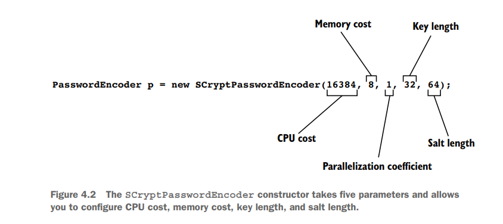

# Section 4: Password Management with passwordEncoders

## How our passwords validated in Spring Security by default

And as soon as the user clicks on the sign-in button or login button, behind the scenes:

1 - Spring Security framework will execute all the logic present inside the authentication provider, 
    and it will try to load the details from the storage system with the help of the method loadUserByUsername 
    which is available inside the implementation classes of user details manager.

2 -Once my user details are loaded, Spring Security framework will try to compare the passwords that are provided by my end user 
   and the password that is loaded from the database.


----------------------------------------------------------------------------------------------------------

##  Understanding the PasswordEncoder contract


- We implement this contract to tell Spring Security how to validate a user’s password.
- In the authentication process, the PasswordEncoder decides if a password is valid or not.

```java
public interface PasswordEncoder {
String encode(CharSequence rawPassword);

boolean matches(CharSequence rawPassword, String encodedPassword);

default boolean upgradeEncoding(String encodedPassword) {
    return false;
        }
}
```

- The interface defines two abstract methods and one with a default implementation.
- The abstract encode() and matches() methods are also the ones that you most often hear about when dealing with a PasswordEncoder implementation.
- The purpose of <b>the encode(CharSequence rawPassword)</b> method is to return a transformation of a provided string.
- In terms of Spring Security functionality, it’s used to provide encryption or a hash for a given password.
- You can use the <b>matches(CharSequence rawPassword, String encodedPassword)</b> method afterward to check if an encoded string matches a raw password.
- You use the matches() method in the authentication process to test a provided password against a set of known credentials.
- The third method, called upgradeEncoding(CharSequence encodedPassword), defaults to false in the contract.
- If you override it to return true, then the encoded password is encoded again for better security.
- In some cases, encoding the encoded password can make it more challenging to obtain the cleartext password from the result.

----------------------------------------------------------------------------------------------------------

## Implementing the PasswordEncoder contract

  the two methods matches() and encode() have a strong relationship: a
  string returned by the encode() method should always be verifiable with the
  matches() method of the same PasswordEncoder.


### Choose how the application manages passwords for the authentication process. 

1 - The most straightforward implementation is a password encoder that considers passwords in plain text: that is, it does not do any encoding on the password.

```java
public class PlainTextPasswordEncoder implements PasswordEncoder {
    
@Override
public String encode(CharSequence rawPassword) {
        return rawPassword.toString();
    }
@Override
public boolean matches(CharSequence rawPassword, String encodedPassword) {
        return rawPassword.equals(encodedPassword);
    }
}
```

The result of the encoding is always the same as the password. 

2 - Implementing a PasswordEncoder that uses SHA-512

```java
public class Sha512PasswordEncoder implements PasswordEncoder {
@Override
public String encode(CharSequence rawPassword) {
        return hashWithSHA512(rawPassword.toString());
    }
@Override
public boolean matches(CharSequence rawPassword, String encodedPassword) {
        String hashedPassword = encode(rawPassword);
        return encodedPassword.equals(hashedPassword);
    }
// Omitted code
}
```

```java
private String hashWithSHA512(String input) {
    StringBuilder result = new StringBuilder();
    try {
        MessageDigest md = MessageDigest.getInstance("SHA-512");
        byte [] digested = md.digest(input.getBytes());
        for (int i = 0; i < digested.length; i++) {
                result.append(Integer.toHexString(0xFF & digested[i]));
            }
        } catch (NoSuchAlgorithmException e) {
                throw new RuntimeException("Bad algorithm");
        }
    return result.toString();
}
```

----------------------------------------------------------------------------------------------------------

## Choosing from the provided implementations of PasswordEncoder

- <b>NoOpPasswordEncoder</b>: Does not encode the password but keeps it in cleartext. We use this implementation only for examples.
                       Because it doesn’t hash the password, you should never use it in a real-world scenario. 
- <b>StandardPasswordEncoder</b>: Uses SHA-256 to hash the password.
                          This implementation is now deprecated, and you shouldn’t use it for your new implementations. 
                          The reason why it’s deprecated is that it uses a hashing algorithm that we don’t consider strong enough anymore, but you might still find this implementation used in existing applications. 
- <b>Pbkdf2PasswordEncoder</b>: Uses the password-based key derivation function (PBKDF2). 
- <b>BCryptPasswordEncoder</b>: Uses a bcrypt strong hashing function to encode the password. 
- <b>SCryptPasswordEncoder</b>: Uses a scrypt hashing function to encode the password.

----------------------------------------------------------------------------------------------------------

## how to create instances of these types of PasswordEncoder implementations.

### NoOpPasswordEncoder: 

  This class is designed as a singleton.

  You can’t call its constructor directly from outside the class, but you can use the NoOpPasswordEncoder.getInstance() method
  to obtain the instance of the class like this:

```java
    @Bean
public PasswordEncoder passwordEncoder() {
        return NoOpPasswordEncoder.getInstance();
        }
```

----------------------------------------------------------------------------------------------------------

### The StandardPasswordEncoder:

You can provide a secret used in the hashing process.

You set the value of this secret by the constructor’s parameter. If you choose to call the no-arguments constructor, the
implementation uses the empty string as a value for the key.

However, the StandardPasswordEncoder is deprecated now, and I don’t recommend that you use it with your new implementations.

You could find older applications or legacy code that still uses it, so this is why you should be aware of it.

The next code snippet shows you how to create instances of this password encoder:

```java
PasswordEncoder p = new StandardPasswordEncoder();
PasswordEncoder p = new StandardPasswordEncoder("secret");
```


```java
@Bean
    public PasswordEncoder passwordEncoder() {
        return new StandardPasswordEncoder("secret");
    }
```

----------------------------------------------------------------------------------------------------------

### Pbkdf2PasswordEncoder

To create instances of the Pbkdf2PasswordEncoder, you have the following options:

```java
PasswordEncoder p = new Pbkdf2PasswordEncoder();
PasswordEncoder p = new Pbkdf2PasswordEncoder("secret");
PasswordEncoder p = new Pbkdf2PasswordEncoder("secret", 185000, 256);
```

The PBKDF2 is a pretty easy, slow-hashing function that performs an HMAC as many times as specified by an iterations argument.

The three parameters received by the last call are:

1 - the value of a key used for the encoding process.

2 - the number of iterations used to encode the password.

3 - the size of the hash.


The second and third parameters can influence the strength of the result.

You can choose more or fewer iterations, as well as the length of the result.

The longer the hash, the more powerful the password.

<b >However, be aware that performance is affected by these values: the more iterations, the more resources your application consumes.</b>

the defaults are 185000 for the number of iterations and 256 for the length of the result.

----------------------------------------------------------------------------------------------------------

###  BCryptPasswordEncoder

Which uses a bcrypt strong hashing function to encode the password.

You can instantiate the BCryptPasswordEncoder by calling the no-arguments constructor.

But you also have the option to specify a strength coefficient representing the log rounds (logarithmic rounds) used in the encoding process.


Moreover, you can also alter the SecureRandom instance used for encoding:

```java
PasswordEncoder p = new BCryptPasswordEncoder();
PasswordEncoder p = new BCryptPasswordEncoder(4);
SecureRandom s = SecureRandom.getInstanceStrong();
PasswordEncoder p = new BCryptPasswordEncoder(4, s);
```

The log rounds value that you provide affects the number of iterations the hashing operation uses.

The number of iterations used is 2 <sup>log rounds</sup>.

For the iteration number computation, the value for the log rounds can only be between 4 and 31.

----------------------------------------------------------------------------------------------------------

### SCryptPasswordEncoder

This password encoder uses an scrypt hashing function.

For the ScryptPasswordEncoder, you have two options to create its instances:

```java
PasswordEncoder p = new SCryptPasswordEncoder();
PasswordEncoder p = new SCryptPasswordEncoder(16384, 8, 1, 32, 64);
```



----------------------------------------------------------------------------------------------------------

## Multiple encoding strategies with DelegatingPasswordEncoder

Imagine somebody finds a vulnerability in the currently used algorithm, and you want to change it for newly registered users,
but you do not want to change it for existing credentials.

So you end up having multiple kinds of hashes. How do you manage this case?
While it isn’t the only approach for this scenario, a good choice is to use a <b>DelegatingPasswordEncoder</b> object.

The DelegatingPasswordEncoder is an implementation of the PasswordEncoder interface that,
instead of implementing its encoding algorithm, delegates to another instance of an implementation of the same contract.

The hash starts with a prefix naming the algorithm used to define that hash.

The DelegatingPasswordEncoder delegates to the correct implementation of the PasswordEncoder based on the prefix of the password.


The DelegatingPasswordEncoder has a list of PasswordEncoder implementations to which it delegates.

The DelegatingPasswordEncoder stores each of the instances in a map. 

The NoOpPasswordEncoder is assigned to the key noop, while the BCryptPasswordEncoder implementation is assigned the key bcrypt.

When the password has the prefix {noop}, the DelegatingPasswordEncoder delegates the operation to the NoOpPasswordEncoder implementation.

If the prefix is {bcrypt}, then the action is delegated to the BCryptPasswordEncoder implementation


### Creating an instance of DelegatingPasswordEncoder

```java
@Configuration
public class ProjectConfig {
        // Omitted code
        @Bean
        public PasswordEncoder passwordEncoder() {
                Map<String, PasswordEncoder> encoders = new HashMap<>();
                encoders.put("noop", NoOpPasswordEncoder.getInstance());
                encoders.put("bcrypt", new BCryptPasswordEncoder());
                encoders.put("scrypt", new SCryptPasswordEncoder());
                
                return new DelegatingPasswordEncoder("bcrypt", encoders);
        }
}
```
Spring Security offers a way to create a DelegatingPasswordEncoder that
has a map to all the standard provided implementations of PasswordEncoder.

The PasswordEncoderFactories class provides a createDelegatingPasswordEncoder() static method
that returns the implementation of the DelegatingPasswordEncoder with bcrypt as a default encoder:

```java
PasswordEncoder passwordEncoder = PasswordEncoderFactories.createDelegatingPasswordEncoder();
```
----------------------------------------------------------------------------------------------------------

## Encoding vs. encrypting vs. hashing

1 - Encoding refers to any transformation of a given input.

For example, if we have a function x that reverses a string, function x -> y applied to ABCD produces DCBA.


2 - Encryption is a particular type of encoding where, to obtain the output, you provide both the input value and a key.

The key makes it possible for choosing afterward who should be able to reverse the function

3 - Hashing is a particular type of encoding, except the function is only one way.

That is, from an output y of the hashing function, you cannot get back the input x.

However, there should always be a way to check if an output y corresponds to an input x, so
we can understand the hashing as a pair of functions for encoding and matching.

If hashing is x -> y, then we should also have a matching function (x,y) -> boolean.

