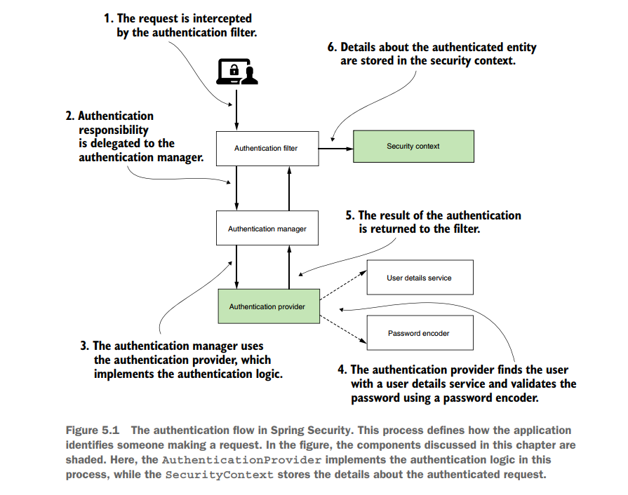
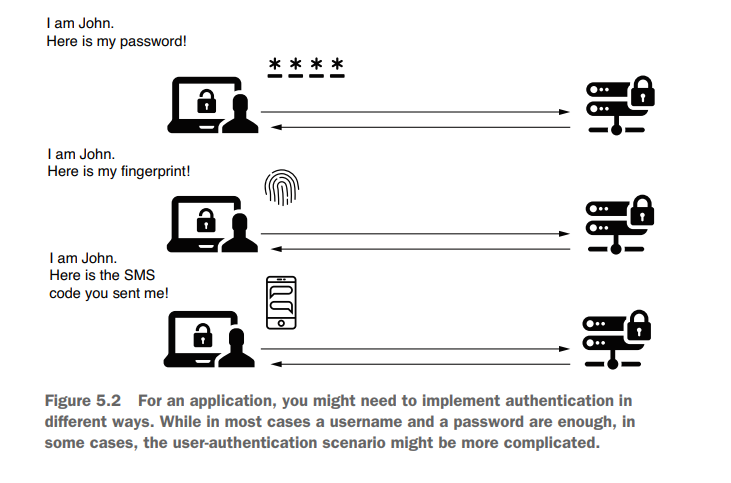
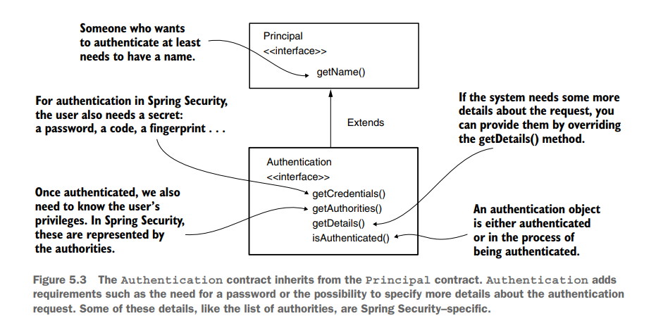
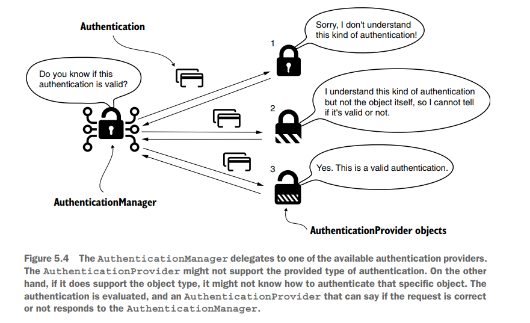
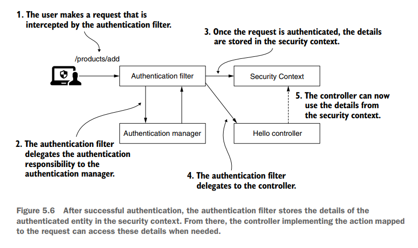

# Understanding Authentication provider and implement it

- The AuthenticationProvider layer, however, is the one responsible for the logic of authentication.

- The AuthenticationProvider is where you find the conditions and instructions that decide whether to authenticate a request or not.

- The component that delegates this responsibility to the AuthenticationProvider is the AuthenticationManager, which receives the request from the HTTP filter layer.


The authentication process, which has only two possible results:

- The entity making the request is not authenticated. The user is not recognized, and the application rejects the request without delegating to the authorization process. 
  Usually, in this case, the response status sent back to the client is HTTP 401 Unauthorized.


- The entity making the request is authenticated. The details about the requester are stored such that the application can use these for authorization.
  The SecurityContext interface is the instance that stores the details about the current authenticated request.




-------------------------------------------------------------------------------------------------------------

## Understanding the AuthenticationProvider

In enterprise applications, you might find yourself in a situation in which the default
implementation of authentication based on username and password does not apply.

For example:

- You might want the user to be able to prove who they are by using a code received in an SMS message or displayed by a specific application. 

- You might even need to use a representation of the user’s fingerprint to implement the authentication logic. 

A framework’s purpose is to be flexible enough to allow you to implement any of these required scenarios.



In terms of Spring Security, you can use the AuthenticationProvider contract to define any custom authentication logic.

-------------------------------------------------------------------------------------------------------------

## Representing the request during authentication

Authentication is one of the essential interfaces involved in the process with the same name.

The Authentication interface represents the authentication request event and holds the details of the entity
that requests access to the application.

You can use the information related to the authentication request event during and after the authentication process.

The user requesting access to the application is called a principal.

If you’ve ever used the Java Security API in any app, you learned that in the Java Security API, an interface named **Principal**
represents the same concept. 

The Authentication interface of Spring Security extends this contract




```java
public interface Authentication extends Principal, Serializable {
    Collection<? extends GrantedAuthority> getAuthorities();
    Object getCredentials();
    Object getDetails();
    Object getPrincipal();
    boolean isAuthenticated();
    void setAuthenticated(boolean isAuthenticated) throws IllegalArgumentException;
}
```

- **isAuthenticated()**: Returns true if the authentication process ends or false if the authentication process is still in progress.
- **getCredentials()**: Returns a password or any secret used in the process of authentication.
- **getAuthorities()**: Returns a collection of granted authorities for the authenticated request.

-------------------------------------------------------------------------------------------------------------

## Implementing custom authentication logic

1. [ ] The AuthenticationProvider in Spring Security takes care of the authentication logic.
2. [ ] The default implementation of the AuthenticationProvider interface delegates the responsibility of finding the system’s user to a UserDetailsService. 
3. [ ] It uses the PasswordEncoder as well for password management in the process of authentication.

```java
public interface AuthenticationProvider {
    Authentication authenticate(Authentication authentication) throws AuthenticationException;
    boolean supports(Class<?> authentication);
}
```

1. [ ] The authenticate() method receives an Authentication object as a parameter and returns an Authentication object.


- We implement the authenticate() method to define the authentication logic. 
- The method should throw an AuthenticationException if the authentication fails. 
- If the method receives an authentication object that is not supported by your implementation of AuthenticationProvider, then the method should return null.
- This way, we have the possibility of using multiple Authentication types separated at the HTTP-filter level. (multiple AuthorizationProvider)
- The method should return an Authentication instance representing a fully authenticated object.
  For this instance, the isAuthenticated() method returns true, and it contains all the necessary details about the authenticated entity.


Usually, the application also removes sensitive data like a password from this instance.
After implementation, the password is no longer required and keeping these details can potentially expose them to unwanted eyes.


2. [ ] supports (Class<?> authentication) method:  You can implement this method to return true if the
   current AuthenticationProvider supports the type provided as an Authentication object.



An analogy of how the authentication manager and authentication provider work
together to validate or invalidate an authentication request is having a more complex
lock for your door.

You can open this lock either by using:

- a card 
- or an old fashioned physical key.


The lock itself is the authentication manager that decides whether to open the door.

To make that decision, it delegates to the two authentication providers:

- one that knows how to validate the card
- or the other that knows how to verify the physical key.


If you present a card to open the door, the authentication provider that
works only with physical keys complains that it doesn’t know this kind of authentication.

But the other provider supports this kind of authentication and verifies whether the
card is valid for the door. 

**This is actually the purpose of the supports() methods.**

-------------------------------------------------------------------------------------------------------------

## Applying custom authentication logic

1- Declare a class that implements the AuthenticationProvider contract.

2- Decide which kinds of Authentication objects the new AuthenticationProvider supports:

- Override the supports(Class<?> c) method to specify which type of authentication is supported by the AuthenticationProvider that we define. 
- Override the authenticate(Authentication a) method to implement the authentication logic.

3- Register an instance of the new AuthenticationProvider implementation with Spring Security.

```java
@Component
public class CustomAuthenticationProvider implements AuthenticationProvider {

    @Autowired
    private UserDetailsService userDetailsService;
    
    @Autowired
    private PasswordEncoder passwordEncoder;
    
    @Override
    public Authentication authenticate(Authentication authentication) {
        String username = authentication.getName();
        String password = authentication.getCredentials().toString();
        UserDetails u = userDetailsService.loadUserByUsername(username);
        if (passwordEncoder.matches(password, u.getPassword())) {
            return new UsernamePasswordAuthenticationToken(
                    username,
                    password,
                    u.getAuthorities());
        } else {
            throw new BadCredentialsException
                    ("Something went wrong!"); // you can customize the password error message form here 
          // If you want to customize the user error message, customize UserDetailsService and override the loadUserByUsername method
        }
    }
    
    
    @Override
    public boolean supports(Class<?> authenticationType) {
            return authenticationType.equals(UsernamePasswordAuthenticationToken.class);
    }
}
```

1. [ ] We mark the class with @Component to have an instance of its type in the context managed by Spring. 
2. [ ] We make use of the UserDetailsService implementation to get the UserDetails.

- If the user doesn’t exist, the loadUserByUsername() method should throw an AuthenticationException.

  In this case, the authentication process stops, and the HTTP filter sets the response status to HTTP 401 Unauthorized.

  If the username exists, we can check further the user’s password with the matches() method of the PasswordEncoder from the context.

- If the password does not match, then again, an AuthenticationException should be thrown.
- If the password is correct, the AuthenticationProvider returns an instance of Authentication marked as “authenticated,” which contains the details about the request.

-------------------------------------------------------------------------------------------------------------

# Using the SecurityContext

Once the AuthenticationManager completes
the authentication process successfully, it stores the Authentication instance for the
rest of the request. The instance storing the Authentication object is called the security context.



```java
public interface SecurityContext extends Serializable {
    Authentication getAuthentication();
    void setAuthentication(Authentication authentication);
}
```

```java
@GetMapping("/hello")
public String hello() {
    SecurityContext context = SecurityContextHolder.getContext();
    Authentication a = context.getAuthentication();
    return "Hello, " + a.getName() + "!";
}
```

Obtaining the authentication from the context is even more comfortable at the endpoint level, as Spring knows to inject it directly into the method parameters.

You don’t need to refer every time to the SecurityContextHolder class explicitly.

This approach, as presented in the following listing, is better.

```java
@GetMapping("/hello")
public String hello(Authentication a) {
    return "Hello, " + a.getName() + "!";
}
```

-------------------------------------------------------------------------------------------------------------

## Understanding HTTP Basic and form-based login authentications

Up to now, we’ve only used HTTP Basic as the authentication method.

The HTTP Basic authentication method is simple, which makes it an excellent choice for examples and demonstration purposes or proof of concept.

But for the same reason, it might not fit all the real-world scenarios that you’ll need to implement.

### Using and configuring HTTP Basic

You are aware that HTTP Basic is the default authentication method.

For theoretical scenarios, the defaults that HTTP Basic authentication comes with are great.

But in a more complex application, you might find the need to customize some of these settings.

For example: you might want to implement a specific logic for the case in which the authentication process fails.

You might even need to set some values on the response sent back to the client in this case.

```java
@Configuration
public class SecurityConfig {

  @Bean
  SecurityFilterChain securityFilterChain(HttpSecurity http) throws Exception {
    http
            .csrf().disable()
            .authorizeHttpRequests()
            .requestMatchers("/home").authenticated()
            .requestMatchers("/register").permitAll()
            .and().formLogin().
            and().httpBasic();
    return http.build();
  }
}
```

